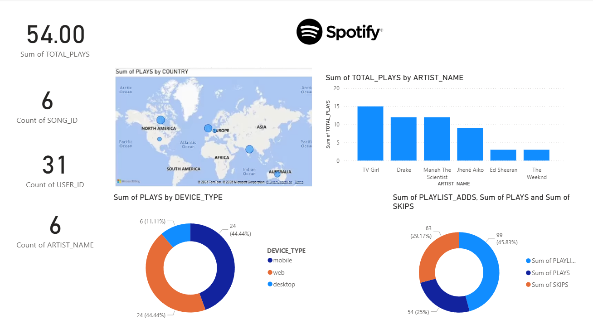

# Spotify Data Engineering Pipeline

A modern end-to-end data engineering project simulating real-time Spotify streaming data ingestion, transformation, and analytics.  
This pipeline demonstrates key components of the modern data stack, from event streaming to visualization.

---

## Overview

This project simulates real-time Spotify events (song plays, skips, etc.) and processes them through a complete data engineering pipeline using open-source and cloud-native tools.

The pipeline architecture includes:

1. **Kafka** for event streaming  
2. **Airflow** for orchestration  
3. **MinIO** for raw data lake storage (bronze layer)  
4. **Snowflake** for data warehousing (silver and gold layers)  
5. **dbt** for data transformation and modeling  
6. **Power BI** for analytics and visualization

---
## Power BI Dashboard

The final Power BI dashboard provides insights into user engagement and artist performance.

**Key Metrics**
- Total Plays, Skips, and Playlist Adds
- Active Users and Songs
- Geographic distribution of plays
- Device type distribution (mobile, web, desktop)




## Architecture

```text
Spotify Simulator → Kafka → Airflow → MinIO → Snowflake → dbt → Power BI

